#  

Caesium is a cursive typeface for programming, derived as a hard fork from [Cascadia Code](https://github.com/microsoft/cascadia-code). While it inherits some of Cascadia’s structure, Caesium takes a more radical approach in design.

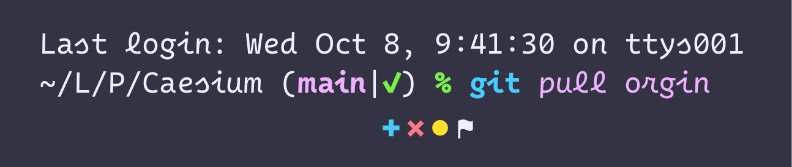

## Downloads

The built font files are committed under `exported/` in this repo.

- Static TTFs: `exported/static/Caesium-*.ttf`
- Variable fonts: `exported/variable/CaesiumVF-*.ttf`

You can download the latest archive from the [release page](https://github.com/alphaArgon/Caesium/releases).

Fonts are distributed in both static and variable formats. For Windows users, static font files are recommended for kerning.

## Feature Lookup

| Tag    | Default | Description |
|--------|:-------:|-------------|
| `kern` | On      | Enables submono spacing. |
| `calt` | On      | Optimizes `0x`/`0b` in literals; centers colons between digits. |
| `ss01` | Off     | Enables more cursive letterforms. |
| `ss02` | Off     | Suppresses cursive letterforms. |
| `ss18` | Off     | Enables dotted zeros (defaults to slashed). |
| `dlig` | Off     | Links consecutive horizontal bars (e.g. `###`, `===`). |
| `pwid` | Off     | Enables proportional spacing (breaks column grids).  |

Note that `ss01` and `ss02` are mutually exclusive; do not enable both of them.

## Design

Glyph categories vary:

- Lowercase letters: cursive with a 2° slant.
- Uppercase letters: roman with a 1° slant.
- Symbols and digits: upright.

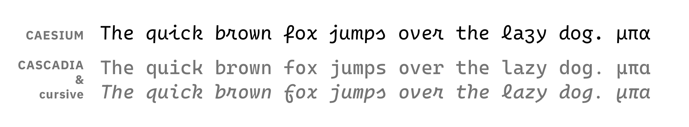

This gives Caesium rhythm, lends characters a script-like feel, and improves legibility.

### Cursiveness

By default, Caesium doesn’t fully adopt cursive forms. For example, ⟨a⟩ and ⟨g⟩ are two-storey (or maybe 1.5-storey?), which gives letters unique shapes and improves the differentiation between similar characters.

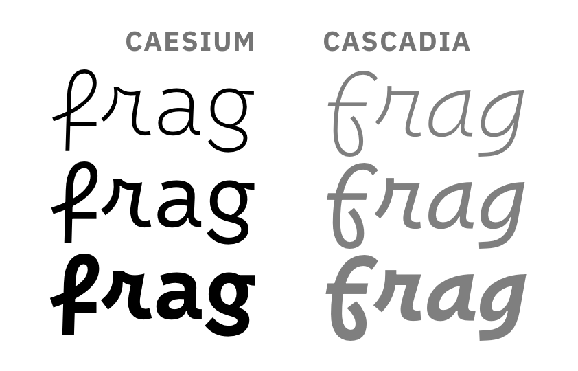

With the OpenType feature `ss01` enabled, or by default in *italic* subfamilies (though they can hardly be called *orthodox* italics), more letters become cursive. The OpenType feature `ss02` can be used to revert cursive *italics*, and makes ⟨z⟩ more distinguishable from ⟨3⟩.

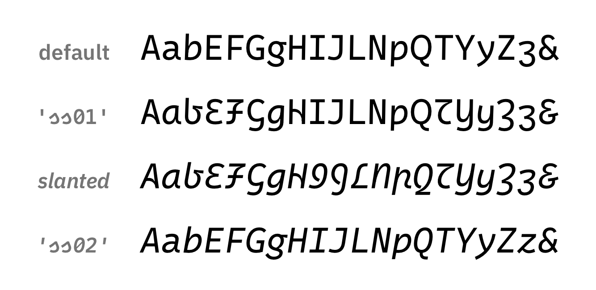

### Submono

Another attractive feature is “submono”: letters inside a word adjust their width and position, while the total width of the word remains unchanged. This allows letters that should have been wide, like ⟨W⟩ and ⟨m⟩, to be relaxed and those that should be narrow, like ⟨I⟩ and ⟨t⟩, to be tightened, resulting in more proportional glyphs.

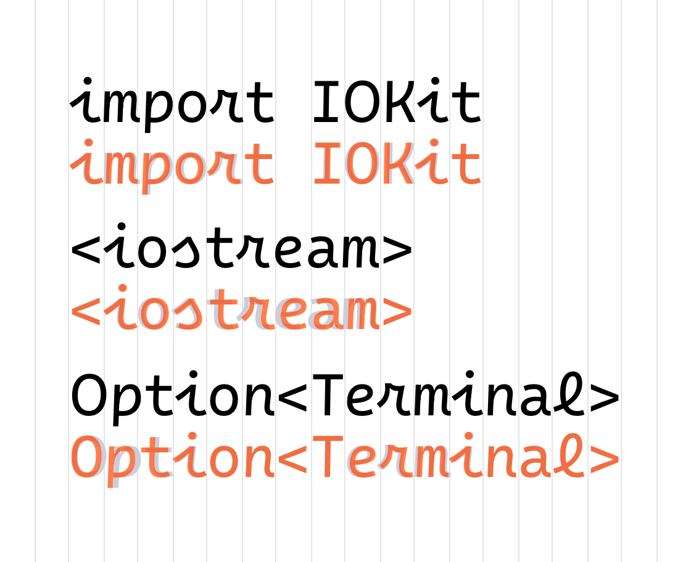

This feature, nominally embodied as `kern`, is not implemented by altering the advance width of each glyph, but by replacing the glyph face (the filled area) to create a visual shift. Therefore, it won’t break column grids where strict monospaced glyphs are required.

### Weight Mapping

Caesium’s default weight (Regular) is lighter than Cascadia’s; it aligns better with other fonts. To replicate Cascadia’s original Regular weight, use Caesium Medium.

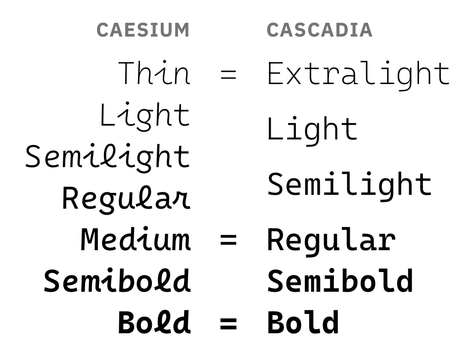

### Coding Ligatures

The author is not a fan of coding ligatures, so Caesium doesn’t include (most of) them. However, there are two exceptions:

- For consistency with digits, ⟨x⟩ and ⟨b⟩ turn into roman forms when part of integer literals. This is implemented by the `calt` feature, which should be on by default.
- To link adjacent bars, e.g. to make consecutive equal signs a double line, you may enable the `dlig` feature, which should be off by default.

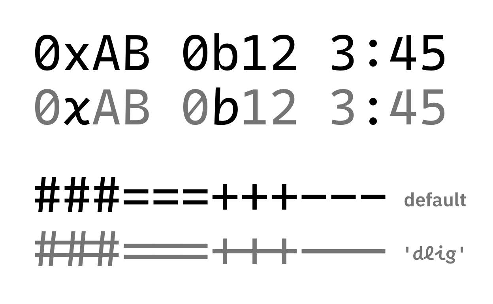

### Misc Optimization

- Enlarged, dot‑like punctuation.
- Curved commas and quotation marks.
- Slashed zeros (including super/subscripts).

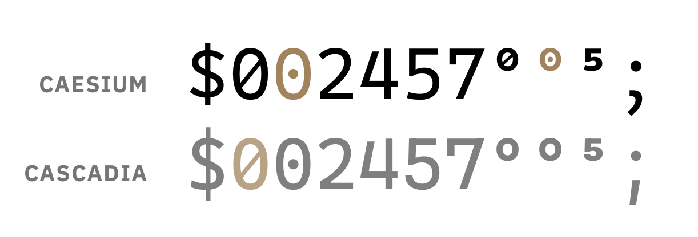

Caesium uses slashed zeros by default, while Cascadia uses dotted ones. To use the latter form, you may enable the feature `ss18`.

Additionally, analogous to the concept of *duospaced* fonts, Caesium has the feature `pwid`. Enabling this feature can make the text more proportional and suitable for regular text.

## Character Coverage

- Adobe Latin 3.
- Adobe Greek 1.
- Cyrillic with regional variants.
- [Powerline symbols](https://github.com/b-ryan/powerline-shell).
- [Fish prompt symbols](https://github.com/fish-shell/fish-shell/blob/master/doc_src/cmds/fish_git_prompt.rst).
- Box drawings.
- Block elements.
- Control symbols.
- Arrows and keyboard symbols.

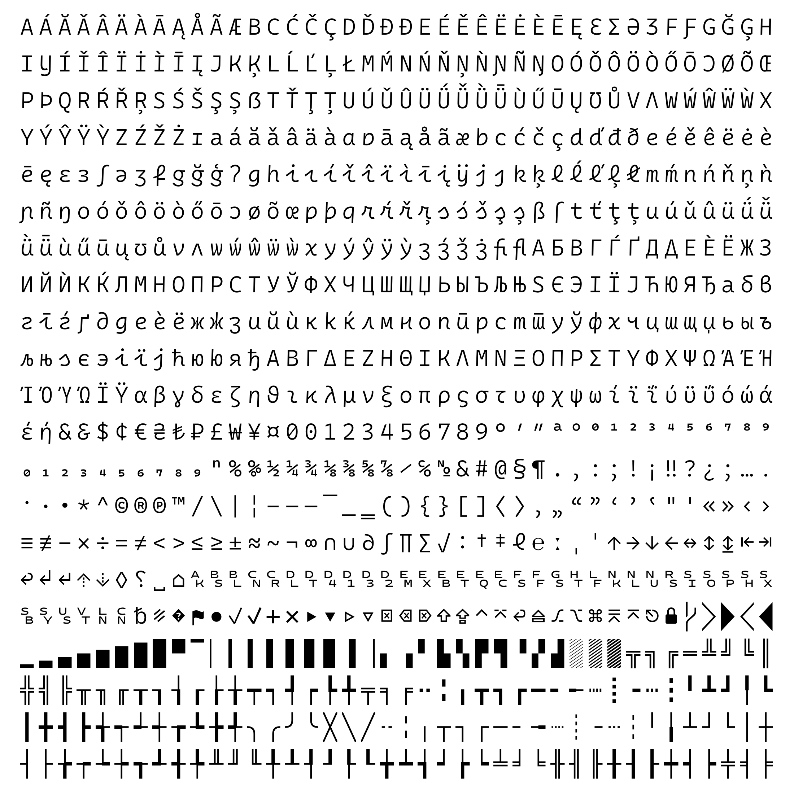

As you can see, lowercase Greek, Cyrillic, arrows and other symbols are fully redesigned.

## Demo in Use

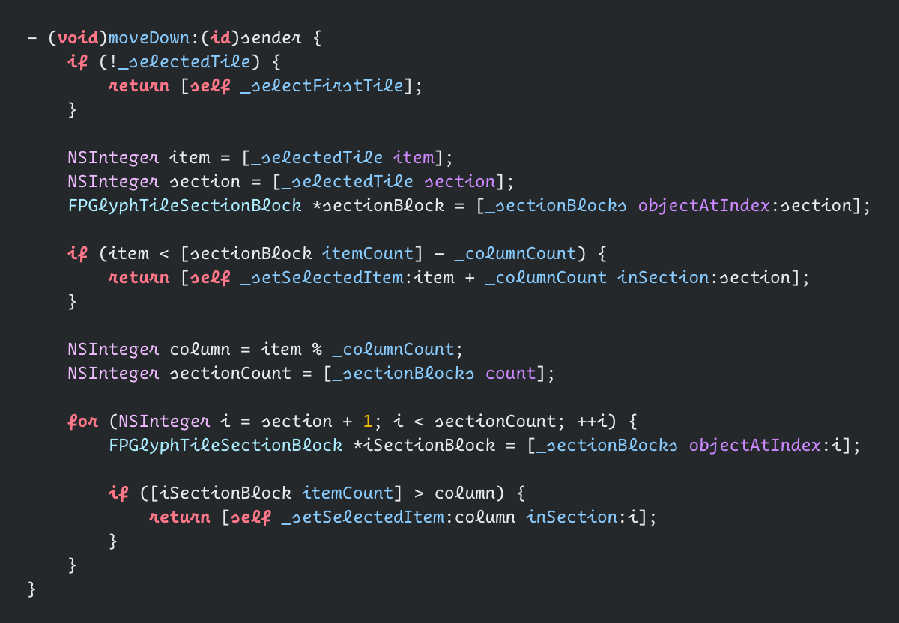

(This theme is called [Aqua](https://github.com/alphaArgon/AquaTheme).)

## Fallback and Pairing

It’s recommended to use the original Cascadia as a fallback for Latin/Cyrillic/Arabic characters, and [方正巴龙草书黑体](https://www.foundertype.com/index.php/FontInfo/index/id/12299) (commercial) or [明鉴草书黑体](https://github.com/Gs-Linguashop/MingjianCaoshuHeiti) (SIL, in progress) for Han. These Han fonts are niche and motivated me to make this project public.

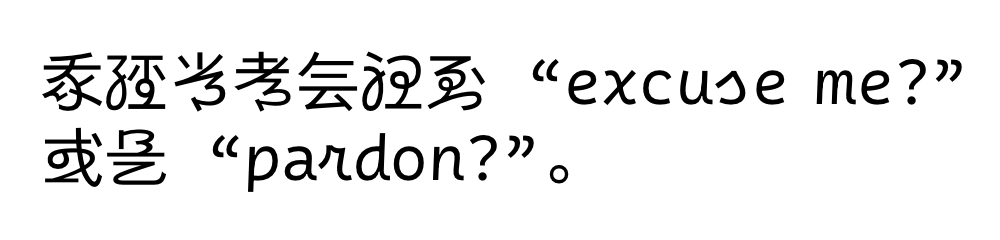

## Tools for Development

- `scripts/plist.js`: Parses a `.glyphs` file (ASCII property list) into a JavaScript object.
- `scripts/apply.js`: Applies submono feature `lookup`s into a `.glyphs` file and writes a modified file.
- `scripts/finalize.js`: Post-processes exported `.ttf` metadata tables. Requires `ttx` from [fonttools](https://fonttools.readthedocs.io).

Building from sources requires [Glyphs.app](https://glyphsapp.com) on macOS. Typical flow: run `apply.js` on the `.glyphs` source, export from Glyphs, then run `finalize.js`.

## License

Caesium is distributed under the SIL Open Font License 1.1. “Caesium” is a font name reserved by me; “Cascadia” is reserved by Microsoft. See the [LICENSE](LICENSE) file for details.
