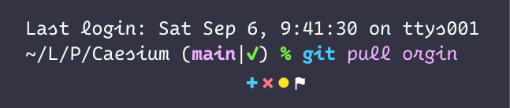

# 

Caesium is a cursive typeface for programming, derived from [Cascadia Code](https://github.com/microsoft/cascadia-code). While it inherits some of Cascadia’s structure, Caesium takes a more radical approach in design.

## Downloads

Font files are available in the `exported` folder. You can download the latest archive of the repo from the [release page](https://github.com/alphaArgon/Caesium/releases).

## Design

Glyph categories vary:

- Lowercase letters: cursive with a 2° slant.
- Uppercase letters: roman with a 1° slant.
- Symbols and digits: upright.

This gives Caesium rhythm, brings characters a script-like feel, and improves legibility.

### Cursiveness

By default, Caesium doesn’t fully adopt cursive forms. For example, ⟨a⟩ and ⟨g⟩ are two-storey (or maybe 1.5-storey?), giving letters unique shapes and improves the differentiation between similar characters.

With the OpenType feature `ss01` enabled, or by default in *italic* subfamilies (though they can hardly be called *orthodox* italics), more letters become cursive. The OpenType feature `ss02` can be used to revert cursive `italics`, as well as make ⟨z⟩ more distinguishable from ⟨3⟩.

### Weight Mapping

Caesium’s default weight (Regular) is lighter than Cascadia’s; it aligns better with other fonts. To replicate Cascadia’s original Regular weight, use Caesium Thick.

### Coding Ligatures

The author is not a big fan of coding ligatures, so Caesium doesn’t include them. However, for consistency with digits, ⟨x⟩ and ⟨b⟩ turn into roman forms when part of integer literals.

### Misc Optimization

- Enlarged, dot‑like punctuation.
- Curved commas and quotation marks.
- Dashed zeros (including super/subscripts).

## Character Coverage

- Adobe Latin 2.
- Adobe Greek 1.
- Box drawings.
- Block elements.
- [Fish git prompt symbols](https://github.com/fish-shell/fish-shell/blob/master/doc_src/cmds/fish_git_prompt.rst).
- Recrafted arrows and keyboard symbols.

## Demo in Use

 (This theme is called [Aqua](https://github.com/alphaArgon/AquaTheme).)

## Fallback and Pairing

It’s recommended to use the original Cascadia as a fallback for Latin/Cyrillic/Arabic characters, and [方正巴龙草书黑体](https://www.foundertype.com/index.php/FontInfo/index/id/12299) for Han.

## License

Caesium is distributed under the SIL Open Font License 1.1. The names “Caesium” and “Cascadia” are reserved font names. See the [LICENSE](LICENSE) file for details.
