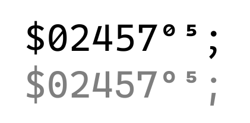

# 

Caesium is a monospaced, cursive typeface derived from [Cascadia Code](https://github.com/microsoft/cascadia-code). While it inherits some of Cascadia’s structure, Caesium is more radical on the design.

## Design

Glyph categories vary.

- Lowercase letters: cursive with a 2° slant.
- Uppercase letters: roman with a 1° slant.
- Symbols and digits: upright.

This gives Caesium a rhythm, brings characters a script feel and makes them more legible.

### Weight Mapping

Caesium’s default weight (Regular) is lighter than Cascadia’s; it matches more closely with other fonts. To replicate Cascadia’s original Regular, use Caesium Thick.

### Hybrid Cursive

Caesium doesn’t fully adopt cursive forms. For example, ⟨a⟩ and ⟨g⟩ are two-storey (or 1.5-storey?), which gives letters unique shapes and improves the differentiation between similar characters.

### Coding Ligatures

The author is not a fan of coding ligatures, so Caesium doesn’t include them. However, for the consistency with digits, ⟨x⟩ and ⟨b⟩ turn into roman forms when part of integer literals.

### Misc Optimization

- Enlarged, dot‑like punctuation.
- Curved commas and quotation marks.
- Dashed zeros (including super/subscripts).

## Character Coverage

- Adobe Latin 2.
- Adobe Greek 1.
- Box drawings.
- Block elements.

## Fallback and Pairing

It’s recommended to use the original Cascadia for fallback of Latin/Cyrillic/Arabic characters, and [方正巴龙草书黑体](https://www.foundertype.com/index.php/FontInfo/index/id/12299) for Han.

## License

Caesium is distributed under the SIL Open Font License 1.1. The names “Caesium” and “Cascadia” are reserved font names. See the [LICENSE](LICENSE) file for details.
